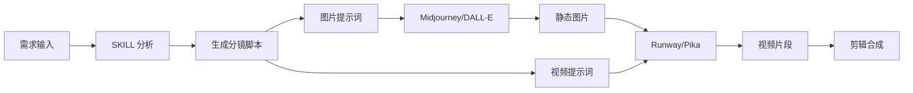

# 🎬 Cinematic Prompts Generator

<div align="center">

**专业的电影级 AI 提示词生成器 | Professional Cinematic AI Prompt Generator**

[](https://github.com/yourusername/cinematic-prompts)
[](./LICENSE)
[](https://claude.ai/claude-code)

[English](#english) | [中文](#中文)

</div>

---

## 中文

### 📖 简介

这是一个专业的 Claude Code SKILL，用于生成电影级别的 AI 提示词系列。它能够将你的创意构想转化为完整的分镜脚本，包含精准的画面描述和镜头运动指导。

**核心特性**：区分**图片生成提示词**和**图转视频提示词**，完美适配现代 AI 创作工作流（先生成图片，再转为视频）。

### ✨ 功能特点

- 🎥 **专业电影术语** - 使用标准的摄影和电影制作术语
- 🎬 **完整镜头设计** - 包含镜头类型、运动、构图等完整信息
- 🎨 **精准视觉描述** - 光影、色彩、氛围的细腻刻画
- 🖼️ **图生视频分离** - 图片提示词与视频提示词严格分离
- 📹 **运动控制优化** - 特别为 Runway、Pika 等工具优化
- 📄 **结构化输出** - Markdown 文档 + JSON 数据
- 🌏 **中英双语** - 中英文提示词同步输出

### 🚀 快速开始

#### 1. 克隆仓库

```bash
git clone https://github.com/yourusername/cinematic-prompts.git
cd cinematic-prompts
```

#### 2. 在 Claude Code 中使用

```bash
# 确保在项目目录中
pwd  # 应显示 .../cinematic-prompts

# 调用 SKILL
/skill cinematic-prompts
```

#### 3. 开始创作

告诉 SKILL 你的需求，例如：
- "创建一个科幻城市的 6 个镜头系列"
- "生成浪漫日落场景的分镜脚本"
- "制作一个动作追逐场景的 8 个镜头"

### 📂 项目结构

```
cinematic-prompts/
├── .clauderc                    # Claude Code 配置
├── .gitignore                   # Git 忽略文件
├── LICENSE                      # MIT 许可证
├── README.md                    # 本文件
├── CHANGELOG.md                 # 版本更新日志
├── skills/
│   └── cinematic-prompts/
│       ├── skill.json          # SKILL 定义
│       └── prompts/
│           └── main.md         # 核心提示词模板
└── examples/
    ├── 浪漫日落场景_分镜脚本_v2.md    # 示例输出
    └── README.md               # 示例说明
```

### 🎯 工作流程



### 📦 输出内容

每个镜头包含：

#### 🖼️ 图片生成提示词（步骤一）
- 构图描述
- 主体细节
- 环境设定
- 光线效果
- 色彩基调
- 氛围营造

#### 🎥 图转视频提示词（步骤二）
- 镜头运动类型
- 运动方向和速度
- 动态元素描述
- 运动控制参数

#### 📊 技术参数
- 焦距、光圈、帧率
- 画幅比例
- 建议时长

### 🛠️ 适用工具

**图片生成**：
- Midjourney v6
- DALL-E 3
- Stable Diffusion XL

**图转视频**：
- Runway Gen-2/Gen-3
- Pika Labs 1.5
- Stability AI SVD

### 💡 使用示例

查看 `examples/` 目录获取完整示例：
- [浪漫日落场景分镜脚本](./examples/浪漫日落场景_分镜脚本_v2.md)

### 🤝 贡献

欢迎提交 Issue 和 Pull Request！

### 📄 许可证

本项目采用 [MIT 许可证](./LICENSE)

### 🙏 致谢

- 基于 [Claude Code](https://claude.ai/claude-code) 构建
- 感谢所有贡献者

---

## English

### 📖 Introduction

A professional Claude Code SKILL for generating cinematic-quality AI prompts. Transform your creative ideas into complete storyboards with precise visual descriptions and camera movement directions.

**Key Feature**: Separates **Image Generation Prompts** and **Image-to-Video Prompts** for modern AI workflows (generate images first, then convert to video).

### ✨ Features

- 🎥 **Professional Cinematography** - Industry-standard film terminology
- 🎬 **Complete Shot Design** - Shot types, movements, and compositions
- 🎨 **Precise Visuals** - Detailed lighting, color, and atmosphere
- 🖼️ **Workflow Optimized** - Separate prompts for image and video
- 📹 **Motion Control** - Optimized for Runway, Pika, etc.
- 📄 **Structured Output** - Markdown docs + JSON data
- 🌏 **Bilingual** - English and Chinese prompts

### 🚀 Quick Start

#### 1. Clone Repository

```bash
git clone https://github.com/yourusername/cinematic-prompts.git
cd cinematic-prompts
```

#### 2. Use in Claude Code

```bash
# Make sure you're in the project directory
pwd  # Should show .../cinematic-prompts

# Invoke the SKILL
/skill cinematic-prompts
```

#### 3. Start Creating

Tell the SKILL what you need:
- "Create a sci-fi city with 6 shots"
- "Generate romantic sunset scene storyboard"
- "Make an 8-shot action chase sequence"

### 🛠️ Supported Tools

**Image Generation**:
- Midjourney v6
- DALL-E 3
- Stable Diffusion XL

**Image-to-Video**:
- Runway Gen-2/Gen-3
- Pika Labs 1.5
- Stability AI SVD

### 💡 Examples

Check the `examples/` directory for complete examples:
- [Romantic Sunset Scene Storyboard](./examples/浪漫日落场景_分镜脚本_v2.md)

### 🤝 Contributing

Issues and Pull Requests are welcome!

### 📄 License

This project is licensed under the [MIT License](./LICENSE)

### 🙏 Acknowledgments

- Built with [Claude Code](https://claude.ai/claude-code)
- Thanks to all contributors

---

<div align="center">

**Made with ❤️ by the community**

[Report Bug](https://github.com/yourusername/cinematic-prompts/issues) · [Request Feature](https://github.com/yourusername/cinematic-prompts/issues)

</div>
